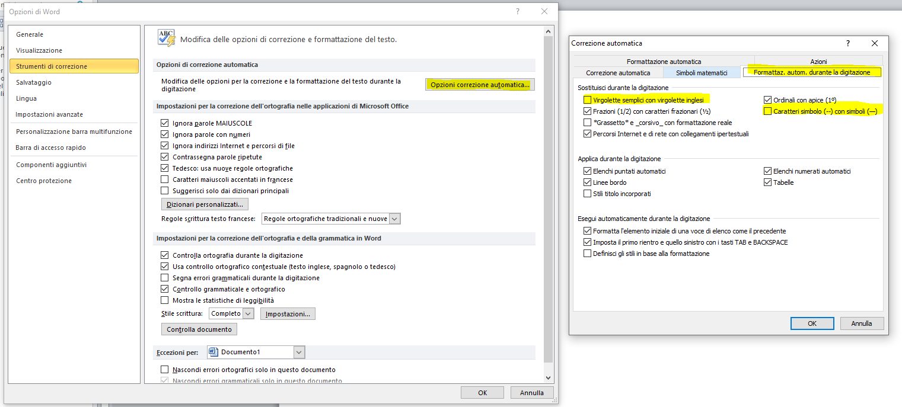

# Word

## Disabilitare la correzione automatica di virgolette e trattini

Dal menu File, andare in Opzioni e poi seguire questo screenshot


## Creazione macro a livello globale per convertire i paragrafi in a capo manuali

Dal menu Visualizza, selezionare il bottone Macro; assicurarsi che nella combo "Macro in: " sia selezionata la voce "Tutti i modelli e i documenti attivi". Inserire nel campo "Nome macro:" `ReplacePMwithMLB`. Fare quindi click sul bottone "Crea"; nell'editor che si apre incollare questo codice e successivamente salvare

```vb
Sub ReplacePMwithMLB()
'
' ReplacePMwithMLB Macro
'
'
    Selection.Find.ClearFormatting
    Selection.Find.Replacement.ClearFormatting
    With Selection.Find
        .Text = "^p"
        .Replacement.Text = "^l"
        .Forward = True
        .Wrap = wdFindStop
        .Format = False
        .MatchCase = False
        .MatchWholeWord = False
        .MatchByte = False
        .MatchAllWordForms = False
        .MatchSoundsLike = False
        .MatchWildcards = False
        .MatchFuzzy = False
    End With
    Selection.Find.Execute Replace:=wdReplaceAll
End Sub
```
