- disabilitare invio di dati telemetrici
  - modificare il registry con [questo file](assets/disable-telemetry.reg)
  - riavviare il computer

- assicurarsi che la dimensione del testo e delle icone sia al 100% e non al 125%
  - tasto destro sul Desktop, scegliere Impostazioni schermo e poi controllare la voce Ridimensionamento e layout

- disabilitare tutti i suoni
  - 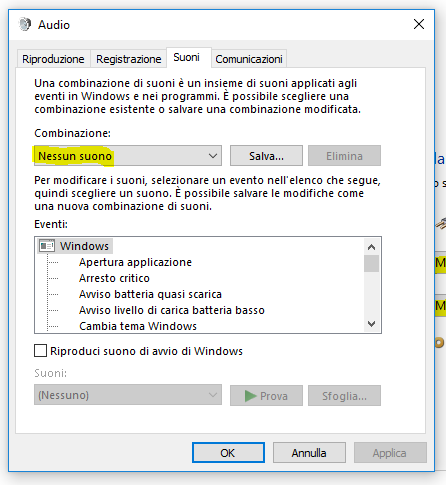

- installare keepass

- installare [Firefox](https://www.mozilla.org/it/firefox/new/) e accedere con l'account per sincronizzare i bookmark

- eseguire un aggiornamento del sistema

- disabilitare avvio automatico di OneDrive

- impostare schermo secondario come unico attivo quando collegato

- abilitare luce notturna

- accedere automaticamente con un utente senza dover inserire la password all'avvio
  ```bat
  control userpasswords2
  ```
  - se non disponibile, usare il programma `Autologon` della `SysinternalsSuite` per abilitare l'accesso automatico

- impostare lo sfondo del desktop
  - [sfondo originale di windows 10](assets/wallpaper-windows-10.jpg)

- impostare il nome delle chiavette USB `J:` e `K:` e il nome dei dischi USB `T:` e `U:`

- configurazione esplora risorse
  - 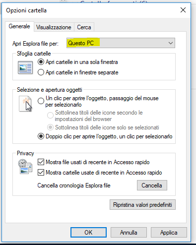
  - 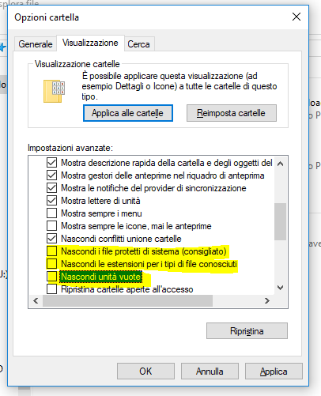
  - 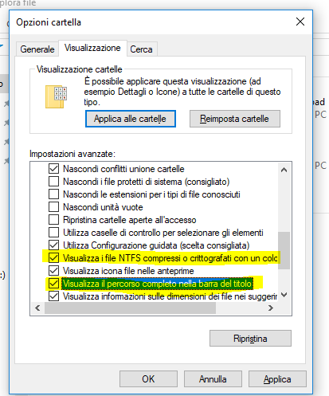

- risparmio energetico (scegliere una delle due seguenti opzioni)
  - 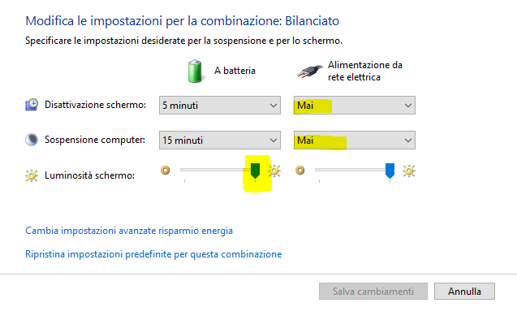
  - 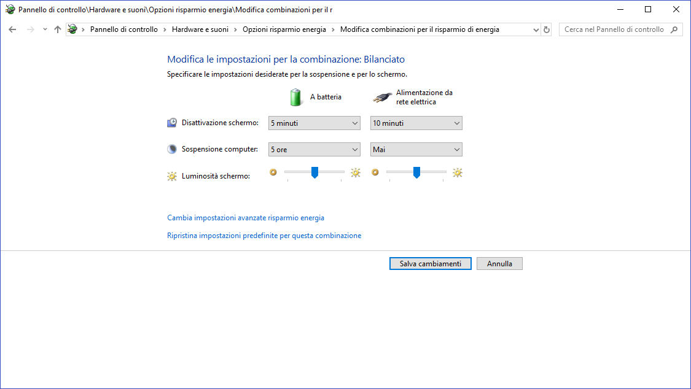

- disabilitare la sospensione del computer quando si chiude il coperchio del portatile **NON DISPONIBILE IN WINDOWS 10 HOME 20H2**
  - 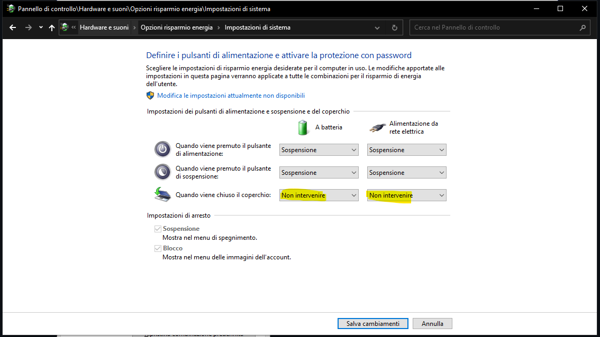

- usa pulsanti piccoli nella barra delle applicazioni
  - 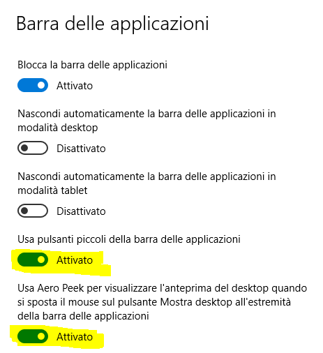

- barra della lingua
  - 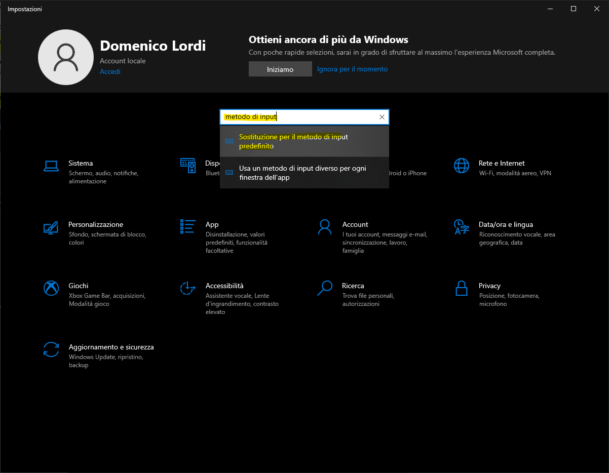
  - 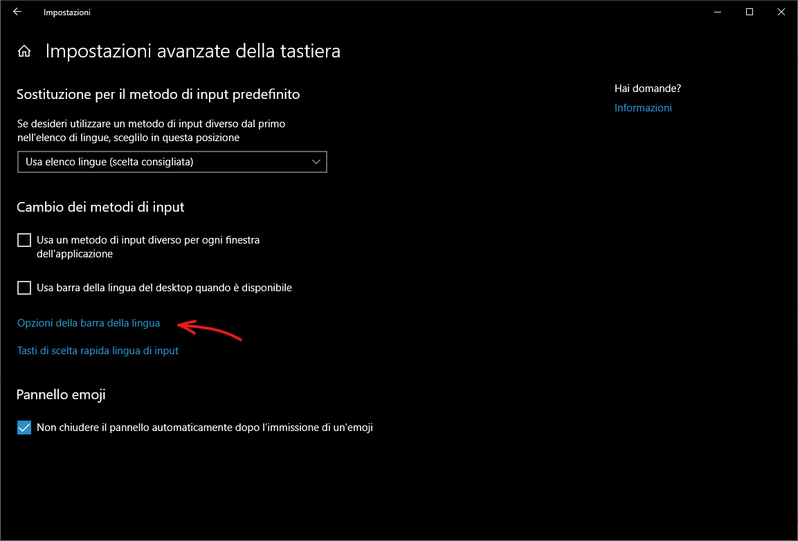
  - 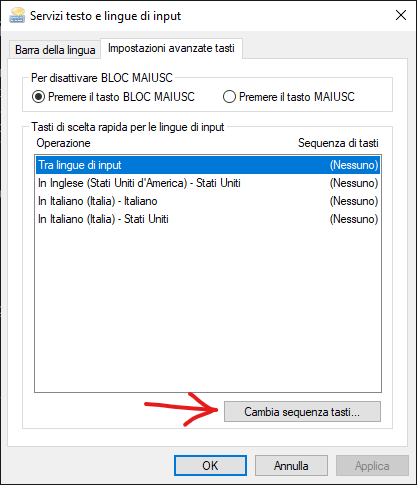
  - 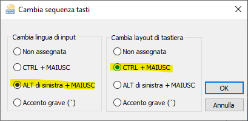

- ~~installare software per la chiavetta Internet~~ non più necessario con la saponetta wifi
  - disabilitare la voce "Consenti a Windows di gestire questa connessione" nelle "Impostazioni di Sistema" -> "Rete e Internet" -> "Cellulare" (bisogna avere la chiavetta collegata per poter vedere questa voce)

- ~~impostare profilo scansione documenti a casa~~ non più necessario con il software "Scanner Windows" scaricato dallo store!
  - 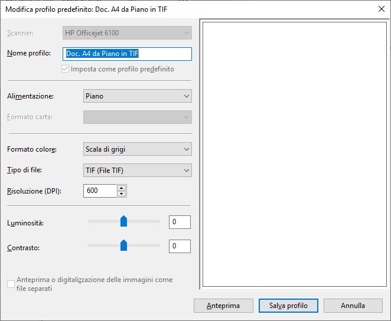

- ~~impostare profilo scansione documenti in ufficio~~
  - 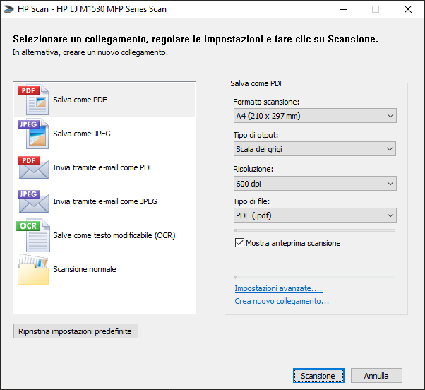

- impostare profilo scansione documenti in ufficio tramite il software "Scanner Windows" scaricato dallo store
  - 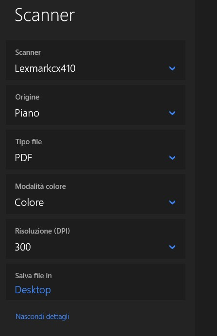

- creare un collegamento sul desktop alla directory `%APPDATA%\Microsoft\Windows\Start Menu\Programs\Startup`

- se si installa git con chocolatey usare questo comando
  ```bat
  choco install git.install --params "/GitOnlyOnPath /NoAutoCrlf /NoShellIntegration /NoGuiHereIntegration /NoShellHereIntegration /SChannel"
  ```

- generare le chiavi SSH per GitHub e GitLab

- installare [Nodepad++](https://notepad-plus-plus.org/downloads/)
  - nelle opzioni, abilitare la chiusura di un file facendo doppio click sul tab

- mettere in esecuzione automatica l'eseguibile di [autohotkey](my-autohotkeys/my-autohotkeys.exe) per poter avere
  - caratteri tilde e backtick
  - drag delle finestre tenendo premuto il tasto windows

- solo per Windows 10 Home, installare [RDPWrap](https://github.com/stascorp/rdpwrap/releases) per poter accedere al PC con desktop remoto 

- installare Chrome, fare l'accesso per sincronizzare impostazioni e bookmark e impostarlo come browser predefinito

- impostare Windows Media Player come lettore multimediale predefinito

- installazione CCleaner
  - in Impostazioni, settare la lingua su Italiano
  - in Pulizia intelligente, disattivare tutte le voci
  - in Avanzate, togliere la spunta da Chiedi se salvare un backup dei problemi del registro
  - in Privacy, togliere la spunta da qualsiasi voce che comporti la condivisione di informazioni

- ~~installare [PowerToys](https://github.com/microsoft/PowerToys/releases/)~~

- ~~abilitare wsl2 (Sottosistema Windows per Linux)~~

- ~~installare edge chromium~~
