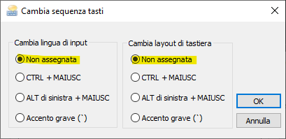

- disabilitare invio di dati telemetrici
  - modificare il registry con [questo file](assets/disable-telemetry.reg)
  - riavviare il computer

- disabilitare tutti i suoni
  - 

- accedere automaticamente con un utente senza dover inserire la password all'avvio **NON DISPONIBILE IN WINDOWS 10 HOME 20H2**
  ```bat
  control userpasswords2
  ```
  - in Windows 10 Home 20H2 è possibile usare il programma `Autologon` della `SysinternalsSuite` per abilitare l'accesso automatico

- impostare lo sfondo del desktop
  - [sfondo originale di windows 10](assets/wallpaper-windows-10.jpg)

- impostare il nome delle chiavette USB `J:` e `K:` e il nome dei dischi USB `T:` e `U:`

- configurazione esplora risorse
  - 
  - 
  - 

- disabilitare la sospensione del computer quando si chiude il coperchio del portatile **NON DISPONIBILE IN WINDOWS 10 HOME 20H2**
  - 

- usa pulsanti piccoli nella barra delle applicazioni
  - 

- barra della lingua (negli screen shot è riportata la situazione iniziale che è stata modificata per DISABILITARE gli hotkey per cambio lingua e layout tastiera)
  - 
  - 
  - 
  - 

- risparmio energetico (scegliere una delle due seguenti opzioni)
  - 
  - 

- ~~installare software per la chiavetta Internet~~ non più necessario con la saponetta wifi
  - disabilitare la voce "Consenti a Windows di gestire questa connessione" nelle "Impostazioni di Sistema" -> "Rete e Internet" -> "Cellulare" (bisogna avere la chiavetta collegata per poter vedere questa voce)

- ~~impostare profilo scansione documenti a casa~~ non più necessario con il software di scansione scaricato dallo store!
  - 

- ~~impostare profilo scansione documenti in ufficio~~ non più necessario con il software di scansione scaricato dallo store!
  - 

- creare un collegamento sul desktop alla directory `%APPDATA%\Microsoft\Windows\Start Menu\Programs\Startup`

- installare keepass

- installare [Firefox](https://www.mozilla.org/it/firefox/new/) e accedere con l'account per sincronizzare i bookmark

- se si installa git con chocolatey usare questo comando
  ```bat
  choco install git.install --params "/GitOnlyOnPath /NoAutoCrlf /NoShellIntegration /NoGuiHereIntegration /NoShellHereIntegration /SChannel"
  ```

- generare le chiavi SSH per GitHub e GitLab

- installare [Nodepad++](https://notepad-plus-plus.org/downloads/)

- mettere in esecuzione automatica l'eseguibile di [autohotkey](my-autohotkeys/my-autohotkeys.exe) per poter avere
  - caratteri tilde e backtick
  - drag delle finestre tenendo premuto il tasto windows

- installare [PowerToys](https://github.com/microsoft/PowerToys/releases/)

- ~~abilitare wsl2 (Sottosistema Windows per Linux)~~

- ~~installare edge chromium~~
